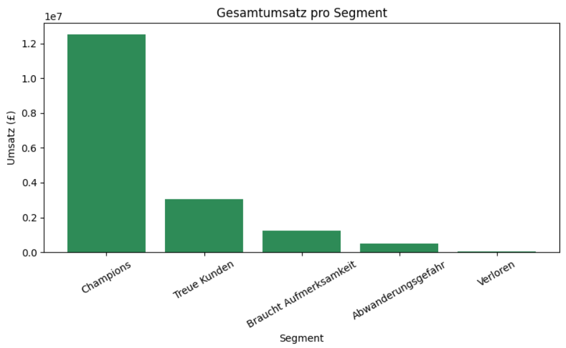
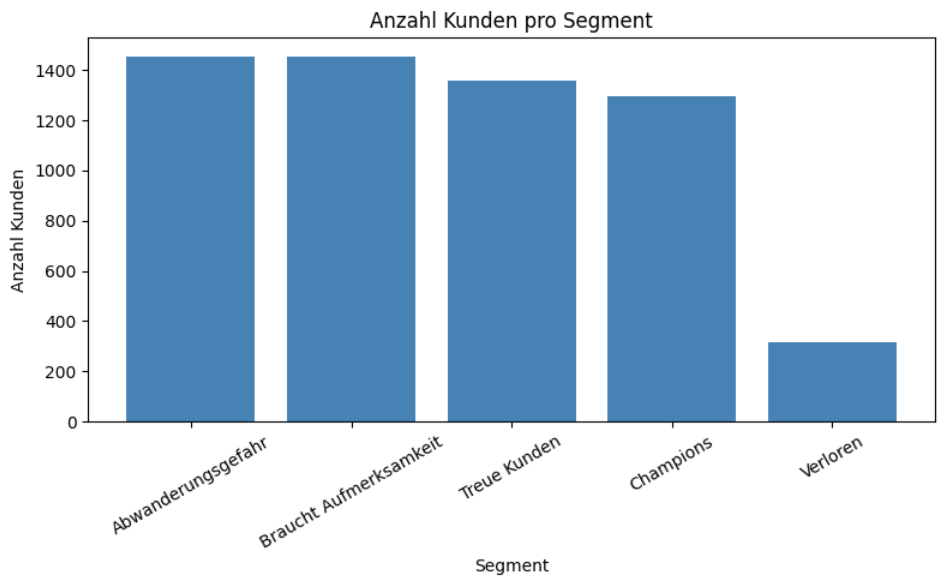
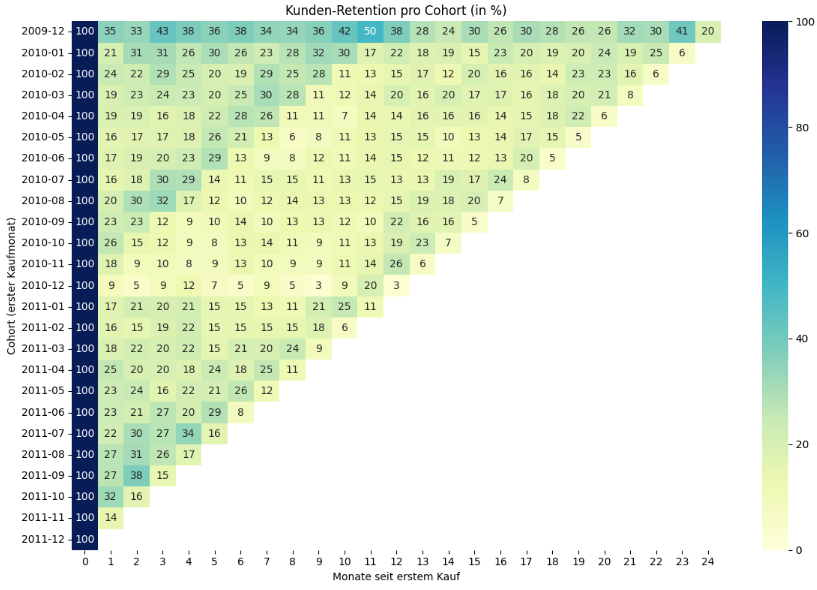

# Customer Segmentation & Retention Analysis (RFM)

Analyse von ca. 780.000 Transaktionen eines UK-Online-Händlers (2009–2011), um Kunden nach Kaufverhalten zu segmentieren und datenbasierte Handlungsempfehlungen zur Kundenbindung abzuleiten.

## Motivation

Als ehemaliger Sales-Mitarbeiter interessiert mich besonders, welche Kunden wirklich den Umsatz treiben und wie man gefährdete Kunden frühzeitig erkennt, bevor sie ganz abspringen. Dieses Projekt wendet die RFM-Methode (Recency, Frequency, Monetary) an, um genau das zu beantworten.

## Datenquelle

- **Dataset:** [Online Retail II](https://archive.ics.uci.edu/dataset/502/online+retail+ii) – UCI Machine Learning Repository
- **Zeitraum:** Dezember 2009 – Dezember 2011
- **Umfang:** 1.067.371 Transaktionszeilen (vor Bereinigung), UK-Online-Händler für Geschenkartikel

## Tools

- **Python** (Pandas, Matplotlib, Seaborn) – Datenbereinigung, RFM-Berechnung, Visualisierung
- **SQL** (SQLite) – alternative Implementierung der RFM-Aggregation zum Vergleich

## Methodik

1. **Datenbereinigung:** Duplikate, fehlende Customer-IDs, stornierte Bestellungen und fehlerhafte Werte (negative Mengen/Preise) wurden entfernt. 73% der Rohdaten (779.425 Zeilen) blieben nutzbar.
2. **RFM-Analyse:** Für jeden der 5.878 Kunden wurden Recency (Tage seit letztem Kauf), Frequency (Anzahl Bestellungen) und Monetary (Gesamtumsatz) berechnet – einmal in Python, einmal zum Vergleich in SQL.
3. **Kundensegmentierung:** Basierend auf RFM-Scores (1–5 pro Dimension) wurden Kunden in 5 Segmente eingeteilt: Champions, Treue Kunden, Braucht Aufmerksamkeit, Abwanderungsgefahr, Verloren.
4. **Cohort-Analyse:** Kunden wurden nach ihrem ersten Kaufmonat gruppiert, um die monatliche Retention über 24 Monate zu verfolgen.

## Ergebnisse

### 1. Starkes Pareto-Muster bei der Kundenwertverteilung
Nur 22% der Kunden (Champions) erwirtschaften **72% des Gesamtumsatzes**.

### 2. Kundensegment-Verteilung
Die größte Gruppe (25%) befindet sich im Segment "Abwanderungsgefahr" – ein klarer Ansatzpunkt für Reaktivierungsmaßnahmen, solange diese Kunden noch nicht ganz verloren sind.

### 3. Schwächere Retention bei neueren Kunden-Cohorts
Die Cohort-Heatmap zeigt, dass die früheste Cohort (Dez. 2009) eine deutlich bessere Kundenbindung aufweist als spätere Cohorts. Zusätzlich ist ein wiederkehrender saisonaler Effekt rund um Monat 11–12 erkennbar (vermutlich Weihnachtsgeschäft).

## Handlungsempfehlungen

1. **Champions priorisieren** – Ein VIP-Programm oder persönlicher Support für die umsatzstärksten 22% der Kunden schützt den Großteil des Umsatzes.
2. **Abwanderungsgefahr gezielt reaktivieren** – Kosteneffiziente E-Mail-Kampagnen für die 1.456 betroffenen Kunden, statt teurer persönlicher Ansprache.
3. **Onboarding neuer Kunden verbessern** – Ein Willkommensangebot für die zweite Bestellung könnte die schwächere Frühphasen-Retention neuerer Cohorts erhöhen.
4. **Saisonale Kampagnen vorziehen** – Reaktivierungs-Mails 3–4 Wochen vor dem beobachteten Monat-11-12-Effekt einplanen, um den natürlichen Trend zu verstärken.

## Limitationen

Einzelne sehr große Bestellungen (vermutlich Großhandelskunden, z.B. eine Bestellung mit über 80.000 Stück) wurden nicht separat behandelt. Eine Trennung zwischen B2B- und B2C-Kunden wäre eine sinnvolle Erweiterung dieser Analyse.

## Wie ausführen

1. Dataset von [UCI](https://archive.ics.uci.edu/dataset/502/online+retail+ii) herunterladen (`online_retail_II.xlsx`)
2. Repository klonen oder Notebook herunterladen
3. Benötigte Bibliotheken installieren: `pip install -r requirements.txt`
4. Notebook `retail_analysis.ipynb` öffnen und ausführen (z.B. in Jupyter oder Google Colab)

## Autor

P.Tharunnya – p.thaeunnya@gmail.com 
